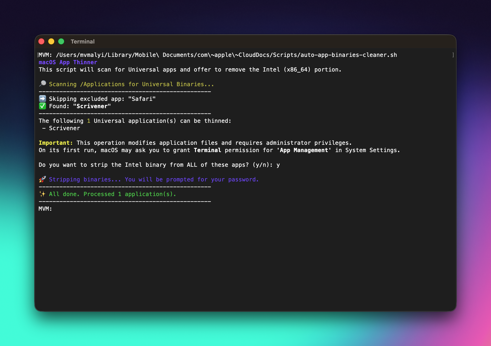

# macOS App Thinner

A simple command-line utility for Apple Silicon Macs to reclaim disk space by removing the Intel (x86_64) architecture from Universal application binaries.



---

### What is this?

Modern macOS applications are often shipped as “Universal Binaries,” which means they contain executable code for both Intel and Apple Silicon (ARM64) processors. While this is great for compatibility, on Apple Silicon (M1, M2, M3, etc.) the Intel portion is unnecessary and consumes SSD space that can be reclaimed.

This script automates finding those applications and “thinning” them by stripping the unneeded Intel slice from the main executable inside each app bundle.

---

### Why

- Save space: Reclaim hundreds of megabytes, or even gigabytes, across a typical Applications folder.
- Minimalism: Keep applications lean and efficient, containing only the code required for the current system.

Note: After an application update, developers typically ship a full Universal binary again. Re-run the script after updates to maintain the native-only state.

---

### Important disclaimer

Modifying application packages always carries some risk, even when using standard Apple developer tools. This script uses `lipo` to remove the x86_64 slice from eligible Universal binaries, which is generally safe when applied to the main executable only.

Always maintain a complete backup (e.g., Time Machine) before running the script. The author accepts no responsibility for any data loss or application corruption.

---

### Prerequisites

- Apple Silicon Mac (arm64: M1, M2, M3, etc.).
- macOS Command Line Tools installed. If needed, install via:
  
```

xcode-select --install

```

---

### How it works

- Scans `/Applications` for `.app` bundles and reads the bundle’s `Info.plist` to identify the main executable (`CFBundleExecutable`).
- Uses `lipo -info` to detect Universal binaries containing both `arm64` and `x86_64`.
- With user confirmation, uses `sudo lipo -remove x86_64 -output "$BINARY" "$BINARY"` to strip the Intel slice in-place.

No changes are made without explicit confirmation.

---

### Install

Clone and enter the repository:

```

git clone https://github.com/your-username/macos-app-thinner.git
cd macos-app-thinner

```

Make the script executable:

```

chmod +x app-thinner.sh

```

---

### Usage

Run the script:

```

./app-thinner.sh

```

The script will:

- Verify it’s running on Apple Silicon (exits on Intel Macs).
- Scan `/Applications` for Universal apps.
- Present a list of candidates and ask for confirmation.
- Prompt for an administrator password (via `sudo`) only when needed to modify binaries.

---

### Excluding apps

By default, `Safari.app` is excluded as a safety precaution. To exclude more applications, edit the `EXCLUDED_APPS` array at the top of `app-thinner.sh`, for example:

```

EXCLUDED_APPS=(
"Safari.app"
"Xcode.app"
"Final Cut Pro.app"
)

```

Entries must match the `.app` bundle name exactly.

---

### Permissions

To modify applications in `/Applications`, administrator privileges are required. The script calls `sudo` for the `lipo` operation, which will prompt for the account password.

On first use, macOS may show a prompt requesting permission for Terminal under Privacy & Security → App Management. Approve this to allow the script to manage apps. This permission can be reviewed later in System Settings.

---

### Limitations and caveats

- App updates will typically restore the full Universal binary, requiring the script to be re-run after updates.
- Only the main executable is stripped; additional helper tools or plug-ins inside the app bundle are not modified.
- Some developers may perform integrity checks; if an application misbehaves after thinning, reinstall it to restore the original binary.

---

### Uninstall / restore

To restore an application to its original state, reinstall or update it from the App Store or the developer’s installer. If a backup exists (e.g., Time Machine), restore the app bundle from before thinning.

---

### License

This project is licensed under the MIT License. See the `LICENSE` file for details.

---

### Script reference

For convenience, here is the script filename used in this repository:

- `app-thinner.sh`
